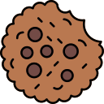

<h1 align="center">
   
  
   
  CookieClean Extension
   
</h1>

  <a href="#key-features">Key Features</a> •
  <a href="#installation">Installation</a> •
  <a href="#how-to-use">How To Use</a> •
  <a href="#support">Support</a>

  <h3>💝 Support the Development</h3>
  
If you find this extension helpful, consider supporting its development!

  
  
  
  
<i>Your support helps maintain and improve CookieClean!</i>

---

  

A powerful and user-friendly Chrome extension for managing and cleaning browser cookies with an elegant brown-themed interface.

## ✨ Key Features

- 🧹 **Clean Current Site**: Remove cookies from the currently active website
- 🌐 **Clean All Sites**: Remove cookies from all websites with one click
- 📊 **Real-time Statistics**: 
  - Total cookies count
  - Number of connected websites
  - Top websites using cookies
- 🚀 **Advanced Cleaning**:
  - Cookies
  - Cache
  - Local Storage
  - Form Data
  - IndexedDB data
  - Service Workers
  - WebSQL data
  - Cache Storage

## Features

- **Clean Current Site**: Remove cookies from the currently active website
- **Clean All Sites**: Remove cookies from all websites with one click
- **Real-time Statistics**: 
  - Total cookies count
  - Number of connected websites
  - Top websites using cookies
- **Advanced Cleaning**:
  - Cookies
  - Cache
  - Local Storage
  - Form Data
  - IndexedDB data
  - Service Workers
  - WebSQL data
  - Cache Storage

## Screenshots

### Main Interface

*The main popup interface with cookie statistics*

### Dark Mode

*Automatic dark mode support*

### Cleaning Process

*Cookie cleaning in action*

## Installation

1. Download or clone this repository
2. Open Chrome/Edge and go to `chrome://extensions/`
3. Enable "Developer mode"
4. Click "Load unpacked"
5. Select the extension directory

## Usage

1. Click the CookieClean icon in your browser toolbar
2. View current cookie statistics
3. Choose cleaning option:
   - Click "Clean Current Site" to remove cookies from current website
   - Click "Clean All Sites" to remove all cookies (requires confirmation)
4. Watch real-time statistics update
5. Check the status message for cleaning confirmation

## Features in Detail

### Cookie Statistics
- Real-time tracking of cookie usage
- List of top websites using cookies
- Total number of active cookies
- Number of connected websites

### Cleaning Options
- Selective cleaning per website
- Complete cleaning of all sites
- Automatic tab refresh after cleaning
- Progress indicators during cleaning

### User Interface
- Clean, modern design
- Smooth animations
- Status messages and warnings
- Loading indicators
- Responsive layout
- Dark mode support

## Technical Details

Built with:
- Manifest V3
- HTML5
- CSS3 (with animations)
- JavaScript (ES6+)
- Chrome Extension APIs

Permissions used:
- cookies
- tabs
- storage
- browsingData
- host permissions for all URLs

## Browser Support

- Google Chrome (version 88+)
- Microsoft Edge (version 88+)
- Other Chromium-based browsers

## Privacy

This extension:
- Does not collect any user data
- Does not send data to external servers
- Works entirely locally in your browser
- Requires only essential permissions

## Contributing

Feel free to submit issues and enhancement requests!

## 💖 Support

If you find CookieClean useful, please consider supporting its development:

- **PayPal**: [Donate via PayPal](https://paypal.me/agenk000)
- **Share**: Tell others about CookieClean
- **Star**: Give us a star on GitHub
- **Feedback**: Share your thoughts and suggestions

Your support helps keep this project alive and growing!

## 📝 License

MIT License - feel free to use and modify for your needs.

---

  Made with ❤️ by the CookieClean Team

## Author

[QUHu-FER]

## Version History

- 1.0: Initial release
  - Basic cookie cleaning
  - Statistics tracking
  - Dark mode support
